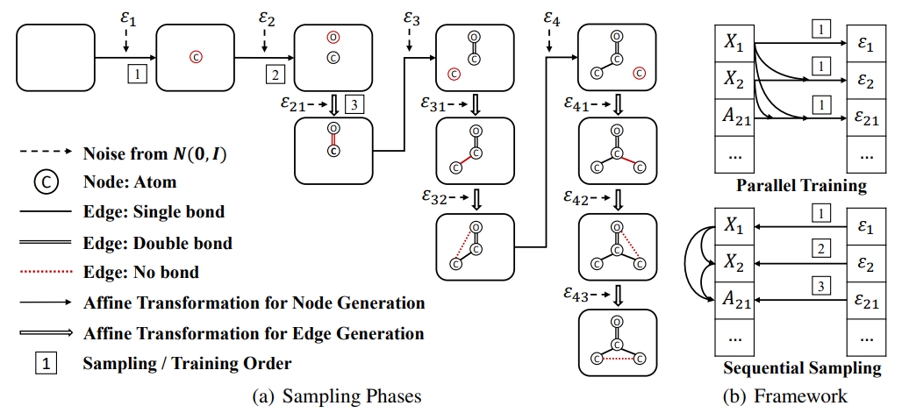

# GraphAF

This is a re-implementation for [GraphAF: a Flow-based Autoregressive Model for Molecular Graph Generation](https://arxiv.org/abs/2001.09382).




## Table of Contents

1. [Usage](#usage)
2. [Citation](#citation)
3. [Acknowledgement](#acknowledgement)

## Usage

### Random Generation

You can use our trained models or train the model from scratch:
```shell script
$ cd examples/ggraph/GraphAF
$ CUDA_VISIBLE_DEVICES=${your_gpu_id} python run_rand_gen.py --train --data=qm9 
$ CUDA_VISIBLE_DEVICES=${your_gpu_id} python run_rand_gen.py --train --data=zinc250k
```
To generate molecules using trained model, first download models from [this link](https://github.com/divelab/DIG_storage/tree/main/ggraph/GraphAF/), then:
```shell script
$ cd examples/ggraph/GraphAF
$ CUDA_VISIBLE_DEVICES=${your_gpu_id} python run_rand_gen.py --num_mols=100 --model_path=${path_to_the_model} --data=qm9
$ CUDA_VISIBLE_DEVICES=${your_gpu_id} python run_rand_gen.py --num_mols=100 --model_path=${path_to_the_model} --data=zinc250k
```

### Property Optimization

For property optimization, we aim to generate molecules with desirable properties (*i.e.*, QED and plogp in this work). You can use our trained models or train the model from scratch by reinforcement learning:
```shell script
$ cd examples/ggraph/GraphAF
$ CUDA_VISIBLE_DEVICES=${your_gpu_id} python run_prop_optim.py --train --prop=plogp
$ CUDA_VISIBLE_DEVICES=${your_gpu_id} python run_prop_optim.py --train --prop=qed
```

To generate molecules using our trained model, first download models from [this link](https://github.com/divelab/DIG_storage/tree/main/ggraph/GraphAF/), then:
```shell scrip
$ cd examples/ggraph/GraphAF
$ CUDA_VISIBLE_DEVICES=${your_gpu_id} python run_prop_optim.py --num_mols=100 --model_path=${path_to_the_model} --prop=plogp
$ CUDA_VISIBLE_DEVICES=${your_gpu_id} python run_prop_optim.py --num_mols=100 --model_path=${path_to_the_model} --prop=qed
```

### Constrained Optimization

For constrained optimization, we aim to optimize molecules with desirable properties (plogp in this work). You can use trained models or train the model from scratch by reinforcement learning:
```shell script
$ cd examples/ggraph/GraphAF
$ CUDA_VISIBLE_DEVICES=${your_gpu_id} python run_cons_optim.py --train --data=graphaf
```

To optimize molecules using trained model, first download models from [this link](https://github.com/divelab/DIG_storage/tree/main/ggraph/GraphAF/), then:
```shell script
$ cd examples/ggraph/GraphAF
$ CUDA_VISIBLE_DEVICES=${your_gpu_id} python run_cons_optim.py --model_path=${path_to_the_model} --data=graphaf
```
### Citation
```
@article{shi2020graphaf,
  title={{GraphAF}: a Flow-based Autoregressive Model for Molecular Graph Generation},
  author={Chence Shi and Minkai Xu and Zhaocheng Zhu and Weinan Zhang and Ming Zhang and Jian Tang},
  journal={iclr},
  year={2020}
}
```

### Acknowledgement
Our implementation is based on [GraphAF](https://github.com/DeepGraphLearning/GraphAF). Thanks a lot for their awesome works.
